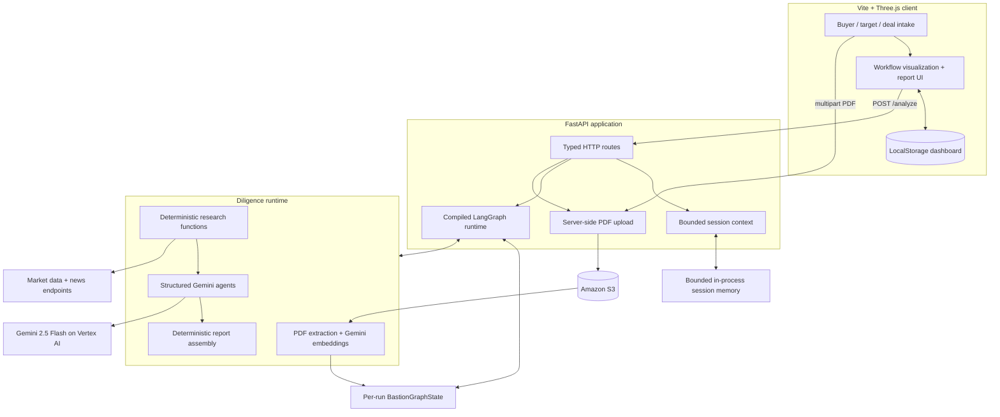
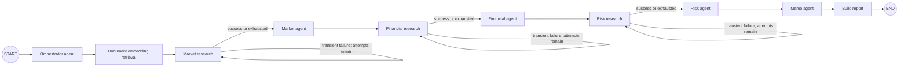
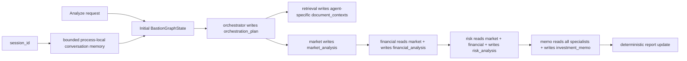

# Bastion

**A stateful, evidence-disciplined multi-agent system for M&A due diligence.**

Bastion turns buyer context, target context, transaction assumptions, and uploaded PDFs into an investment-committee package. Its typed LangGraph state machine combines specialist agents, bounded research retries, S3 document storage, embedding-based retrieval, and isolated shared state.

## Product Surface

Given structured buyer and target inputs, Bastion produces:

- A constrained execution plan with whitelisted tool assignments.
- Market analysis covering sector structure, demand, public-market proxies, and M&A implications.
- Financial analysis covering extracted metrics, QoE, liquidity, valuation support, and transaction structure.
- Acquisition-risk analysis covering severity, likelihood, diligence owners, mitigations, and agreement implications.
- An investment memo with recommendation, evidence status, conditions to proceed, open questions, and source limitations.
- A normalized report package with agent contributions and a deduplicated source register.
- Workflow diagnostics: run ID, actual execution trace, research attempts, terminal statuses, and non-fatal warnings.

The browser experience adds buyer/target intake, PDF upload, a Three.js workflow visualization, structured report rendering, and a local deal-summary dashboard.

## System Architecture



## Stateful Multi-Agent Graph

LangGraph is **stateful**, not stateless. The topology is compiled once, but each invocation receives an isolated `BastionGraphState`. Nodes read the current state and return partial updates; LangGraph merges those updates before routing to the next node.

Not every node is an agent. Bastion deliberately separates model-backed judgment from deterministic retrieval and report construction.



The core workstream is sequential by design:

1. Market conditions establish the demand, competition, timing, and valuation backdrop.
2. Financial analysis consumes the market view before assessing QoE, liquidity, leverage, and structure.
3. Risk analysis consumes both upstream outputs before mapping closing and integration exposure.
4. Memo synthesis consumes all specialist outputs before making a recommendation.

Parallelizing those agents would reduce wall-clock time but weaken the information dependencies the product is intended to preserve. Bastion instead parallelizes independent I/O *inside* research nodes with bounded thread pools.

## State Ownership and Memory

The graph state is the shared working record for one invocation:



| Mechanism | Scope | Purpose | Current implementation |
| --- | --- | --- | --- |
| `BastionGraphState` | One analysis run | Typed working record shared by graph nodes | LangGraph `TypedDict` with reducers |
| Embedding retrieval | One analysis run | Page-aware S3 excerpts selected per specialist | Gemini embeddings + cosine ranking |
| Partial node update | One superstep | Add or replace fields without mutating global state | Dictionary returned by each node |
| Session memory | Process lifetime | Bounded continuity for requests sharing `session_id` | Lock-protected in-memory store |
| Checkpointer | Across restarts | Resume, replay, or time-travel | Deliberately not enabled |
| LangGraph Store | Across workflows | Searchable long-term memory | Not implemented |

Every `/analyze` request generates a new `workflow_run_id` for correlation, while the graph invocation starts from a newly constructed state object. Tests invoke the same compiled graph repeatedly and verify that company context and run IDs do not leak between deals. Conversation memory is loaded separately, truncated to bounded character budgets, and cannot replace the current structured deal context.

This is intentional scope control. Bastion currently needs agents to share findings *during* a workflow, which `StateGraph` already provides. A checkpointer should be added only when product requirements include pause/resume, crash recovery, human approval, replay, or long-running jobs.

## Reliability Model

Bastion uses separate failure policies for separate failure domains:

- **Research retrieval:** each research node has a conditional self-edge and at most three attempts.
- **Cycle safety:** LangGraph also receives a recursion limit of 32 as a second termination guard.
- **Evidence failure:** after retry exhaustion, the specialist receives a machine-readable limitation packet and continues only from supplied context.
- **Model transport:** Gemini retries HTTP `429` and transient `5xx` responses plus transport failures with exponential backoff.
- **Planning failure:** a failed orchestrator falls back to a validated, dependency-preserving default plan and emits a warning.
- **Output integrity:** Gemini responses are validated directly against Pydantic JSON schemas; the final report is assembled deterministically.

Two append-only reducer fields, `execution_trace` and `workflow_warnings`, make retries and fallbacks observable rather than silently overwriting prior events.

## Evidence Discipline

The schema forces findings to distinguish source-backed evidence, tool results, analyst inference, user assumptions, and unresolved diligence. Live research packets carry URLs, publishers, retrieval dates, errors, and deal relevance where available. If evidence is absent, the output records the missing item and its decision impact instead of manufacturing a metric, multiple, citation, or risk.

Current research functions include:

- Page-aware PDF extraction and embedding retrieval from private S3 uploads.
- Yahoo Finance chart data for detected tickers and public-market proxies.
- Google News RSS searches for sector, transaction, regulatory, cyber, and competitive signals.
- Deterministic extraction of financial and risk signals from supplied text.
- Derived runway calculations when both cash and burn inputs are present.

## Performance Engineering

The benchmark harness runs the ten-node success path with synthetic agent/research outputs, measuring local orchestration and state overhead rather than Gemini, embedding, S3, or internet latency.

| Local operation, 100 runs | p50 | p95 |
| --- | ---: | ---: |
| Ten-node state graph | 1.896 ms | 2.746 ms |
| In-memory session-message write | 0.001 ms | 0.003 ms |
| Bounded recent-context read | 0.002 ms | 0.003 ms |

Environment: Python 3.13.13 on Windows 11. The 100-run baseline demonstrates that local graph routing is small compared with the external model and research calls intentionally excluded from the harness. See [`docs/performance-baseline.json`](docs/performance-baseline.json) for the complete result and machine metadata.

### Token-efficiency baseline

LangGraph does not reduce tokens by itself. Bastion reduces context growth by using graph state as a typed working record and projecting only the plan step and upstream outputs required by the next agent. The benchmark compares that implementation with a counterfactual stateless chat that must replay its complete prior user/assistant transcript on every downstream call.

| Agent input | Selective shared state | Transcript replay | Estimated reduction |
| --- | ---: | ---: | ---: |
| Orchestrator | 1,601 | 1,601 | 0.00% |
| Market | 4,472 | 7,004 | 36.15% |
| Financial | 4,970 | 9,676 | 48.64% |
| Risk | 6,319 | 13,648 | 53.70% |
| Memo | 4,961 | 14,834 | 66.56% |
| **Five-call total** | **22,323** | **46,763** | **52.26%** |

The fixed `synthetic-buyer-target-v1` fixture therefore uses an estimated **24,440 fewer input tokens**, with the advantage increasing downstream as transcript history accumulates. Both scenarios keep the same five calls, Gemini 2.5 Flash target, system instruction, response schemas, company context, research packets, and fixed outputs.

These planning estimates use `ceil(UTF-8 request bytes / 4)` and include system instructions and response schemas. They exclude actual tokenization, outputs, retries, and live research. See [`docs/token-efficiency-baseline.json`](docs/token-efficiency-baseline.json); the harness can also call Vertex AI `countTokens`.

The production frontend build separates Bastion's 40.72 kB application chunk (13.29 kB gzip) from the 519.16 kB Three.js vendor chunk (129.80 kB gzip). That keeps application deployments small and allows browsers/CDNs to cache the rendering engine independently.

Performance decisions already represented in the code:

- A lock-protected in-memory session store avoids adding database latency before durable memory is a product requirement.
- Independent quote/news fetches run concurrently while dependency-heavy agents remain sequential.
- Typed state projects only required upstream outputs into each agent instead of replaying the complete workflow transcript.
- Agent handoff payloads and session context have explicit character bounds to control token growth.
- Vertex client creation is deferred until the first model operation, so local graph inspection and prompt-only tests do not resolve cloud credentials.
- Network calls use finite timeouts and result caps.
- Deterministic calculation and report nodes avoid unnecessary model calls.
- Rolldown vendor grouping isolates Three.js from frequently changing application code.

Reproduce the baseline:

```powershell
.\.venv\Scripts\python.exe backend\benchmarks\benchmark_orchestration.py --iterations 100
.\.venv\Scripts\python.exe backend\benchmarks\benchmark_token_efficiency.py --counter estimate --output docs\token-efficiency-baseline.json
# Exact Gemini counts; sends the synthetic fixture to the configured Vertex project.
.\.venv\Scripts\python.exe backend\benchmarks\benchmark_token_efficiency.py --counter gemini
```

## API

| Method | Route | Responsibility |
| --- | --- | --- |
| `GET` | `/` | Health check |
| `POST` | `/analyze` | Run the typed diligence graph |
| `POST` | `/chat` | Session-aware diligence chat |
| `POST` | `/documents/upload` | Validate and upload a PDF through the backend to S3 |
| `GET` | `/sessions/{session_id}/memory` | Inspect process-local conversation messages |
| `GET` | `/workflow/graph` | Inspect the runtime node/edge manifest |

FastAPI also exposes generated OpenAPI documentation at `/docs` when the backend is running.

## Stack

- **Backend:** Python, FastAPI, Pydantic, LangGraph
- **Reasoning:** Google Gemini 2.5 Flash through Vertex AI
- **State:** typed per-run LangGraph state plus bounded in-process session memory
- **Research:** S3 PDF extraction, Gemini embeddings, deterministic tools, Yahoo Finance, Google News RSS
- **Object storage:** Amazon S3 via Boto3
- **Frontend:** Vite, vanilla JavaScript, Three.js

## Repository Map

```text
Bastion/
|-- backend/
|   |-- agents/              # Agent prompts and LangGraph orchestration
|   |-- benchmarks/          # Reproducible local performance harness
|   |-- tests/               # Topology, retry, state-isolation, memory, API tests
|   |-- tools/               # Market, financial, and risk research functions
|   |-- main.py              # FastAPI routes
|   |-- memory.py            # Bounded process-local session store
|   |-- document_retrieval.py # PDF chunking, embedding, and ranking
|   |-- report_service.py    # Deterministic report normalization
|   `-- schemas.py           # Cross-agent and API contracts
|-- docs/
|   |-- langgraph-workflow.md
|   `-- performance-baseline.json
`-- frontend/                # Vite + Three.js client
```

## Run Locally

Requirements: Python 3.10+ and Node.js 22.12+.

```powershell
git clone https://github.com/rogerrrmalcolm/Bastion.git
cd Bastion
py -m venv .venv
.\.venv\Scripts\Activate.ps1
pip install -r backend\requirements.txt
Copy-Item .env.example .env
```

Configure `.env`, then start the API from the repository root:

```powershell
.\.venv\Scripts\python.exe -m uvicorn main:app --app-dir backend --reload
```

In a second terminal:

```powershell
cd frontend
npm install
npm run dev
```

For a deployed frontend, create `frontend/.env.local` with:

```env
VITE_API_BASE_URL=https://your-backend.example.com
```

## Configuration

| Variable | Required | Purpose |
| --- | --- | --- |
| `GOOGLE_GENAI_USE_VERTEXAI` | Yes | Set `true` for Vertex AI |
| `GOOGLE_CLOUD_PROJECT` | Yes | Google Cloud project ID |
| `GOOGLE_CLOUD_LOCATION` | Yes | Vertex AI region |
| `GEMINI_EMBEDDING_MODEL` | No | Defaults to `gemini-embedding-001` |
| `GOOGLE_APPLICATION_CREDENTIALS` | Deployment-dependent | Service-account file path; use workload identity in production where possible |
| `S3_BUCKET` | For PDF upload | Destination bucket |
| `AWS_REGION` | For PDF upload | Bucket region |
| `S3_PREFIX` | No | Object-key prefix; defaults to `pdfs` |
| `CORS_ORIGINS` | No | Comma-separated allowed frontend origins |

## Verification

```powershell
.\.venv\Scripts\python.exe -m unittest discover -s backend\tests -v
.\.venv\Scripts\python.exe -m compileall backend
cd frontend
npm run build
```

Tests cover agent order, embedding ranking and handoffs, retries, graph parity, run/session isolation, context bounds, and API behavior.

## Current Boundaries

- PDF files stay in S3; page-aware chunks and embeddings are request-scoped, not persisted or reused. Scanned PDFs require OCR, and `deal_id` indexing is not wired yet.
- Graph state and session history are process-local. Restarting the backend discards them; pause/resume and crash recovery are not current product features.
- A durable checkpointer or database should be selected only when those requirements exist, with retention, encryption, tenant isolation, and multi-worker behavior designed first.
- Authentication and tenant authorization are not implemented. Supabase environment variables may exist in local configuration, but no Supabase code path is currently active.
- The frontend dashboard stores summaries in browser `localStorage`; it is not a shared team pipeline.
- S3 access is server-side, but bucket privacy, encryption, lifecycle, IAM, malware scanning, and document deletion remain deployment responsibilities.

## License

MIT
