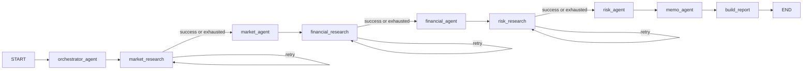

# LangGraph Workflow in Bastion

## Precise Definition

Bastion uses a **stateful LangGraph workflow**. Specialist agents and deterministic support nodes read a typed, request-scoped state object and return partial updates. Edges define legal transitions, and conditional self-edges retry failed research until the graph advances or reaches `END`.

The graph is not a memory database. It is a state-transition runtime. Bastion currently needs shared working state during one analysis, so it deliberately does not add a checkpointer or database.

## Mental Model

| Concept | LangGraph meaning | Bastion implementation |
| --- | --- | --- |
| Graph | Node and transition topology | Compiled once as `DILIGENCE_GRAPH` |
| State | Working record shared during a run | `BastionGraphState` |
| Node | Function that reads state and returns partial updates | Agents, research functions, report builder |
| Edge | Permitted next transition | Fixed handoffs and conditional retry routes |
| Reducer | Rule for combining an update with existing state | Append trace and warning lists with `operator.add` |
| Checkpointer | State snapshots for resume or replay | Not enabled |
| Store | Cross-thread, searchable long-term memory | Not implemented |
| Session memory | Application-owned conversation context | Bounded in-process `memory_store` |

## Runtime Topology



The specialist path remains sequential because its outputs are causally dependent: market informs financial, market and financial inform risk, and all three inform memo synthesis. This is a multi-agent system because independently prompted agents have separate responsibilities and state ownership; multi-agent does not imply parallel execution.

## Shared-State Contract

`BastionGraphState` carries:

- `workflow_run_id`, `session_id`, and current deal context.
- The validated `OrchestrationPlan`.
- Serialized research packets plus attempt, status, and error maps.
- Typed market, financial, risk, memo, and report outputs.
- Append-only execution trace and workflow warnings.

Most fields have one logical writer:

| Node | Reads | Writes |
| --- | --- | --- |
| `orchestrator_agent` | Deal context | `orchestration_plan` |
| `*_research` | Deal context, attempt maps | Research packet, attempt/status/error maps |
| `market_agent` | Plan, market packet, deal context | `market_analysis` |
| `financial_agent` | Plan, market output, financial packet | `financial_analysis` |
| `risk_agent` | Plan, market + financial output, risk packet | `risk_analysis` |
| `memo_agent` | All specialist outputs | `investment_memo` |
| `build_report` | Plan, all analyses, memo | `report` |

For example, the market node returns:

```python
{
    "market_analysis": market_output,
    "execution_trace": ["market_agent"],
}
```

LangGraph merges this partial update into the current state. The next node sees `market_analysis` without any global mutation or database round trip. `execution_trace` and `workflow_warnings` use reducers, so later updates append rather than erase earlier events.

## Invocation Isolation

The graph object is reusable; graph state is not. `/analyze` constructs a new initial dictionary for every request and calls `DILIGENCE_GRAPH.invoke(...)`. A generated `workflow_run_id` is used for correlation only, not persistence.

Tests execute two deals through the same compiled graph and assert that run ID and company context stay isolated. There is no checkpointer, so completed state is returned to the caller and then released. Restarting the backend cannot recover an interrupted run.

## Conditional Cycles

Each research node routes on one status value:

- `retrying` returns to the same research node.
- `succeeded` advances to the specialist.
- `exhausted` advances with an explicit limitation packet.

The application permits three retrieval attempts by default. A graph recursion limit of 32 is an independent guard against malformed routing. Exhaustion does not become silent success: it adds a warning and instructs the specialist to use only supplied context, label unsupported claims, and retain the retrieval limitation.

## Conversation Memory Is Separate

`memory_store` keeps bounded user/assistant history by `session_id` for the lifetime of the backend process. The prompt receives at most six recent messages, 1,200 characters per message, and 6,000 characters total. The current request's structured buyer, target, and deal fields are appended separately, so remembered context cannot replace the active deal input.

This memory is neither graph state nor a LangGraph Store. It is intentionally non-durable. A production database is warranted only if cross-restart continuity, multi-worker sharing, tenant history, retention, or deletion becomes a product requirement.

## Observability

`GET /workflow/graph` returns the declared nodes, edges, routing conditions, state model, and current memory mode. Tests compare this manifest with the compiled graph topology to prevent documentation drift.

Every successful `/analyze` response includes:

- `workflow_run_id`
- `execution_trace`
- `retrieval_attempts`
- `retrieval_statuses`
- `warnings`
- explicit `checkpointing_enabled: false`

These diagnostics explain what happened without exposing the complete internal state object.

## When Persistence Becomes Necessary

Add a LangGraph checkpointer only when Bastion must support at least one of:

- Resume after process or worker failure.
- Human approval interrupts.
- Long-running asynchronous jobs.
- Replay, branching, or audit snapshots.
- State sharing across application workers.

At that point, backend selection should follow deployment requirements rather than defaulting to a local database. Retention, encryption, authorization, deletion, and checkpoint payload growth need to be designed with the storage layer.
