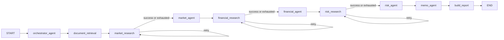

# LangGraph Workflow in Bastion

## Precise Definition

Bastion uses a **stateful LangGraph workflow**. Specialist agents and deterministic support nodes read a typed, request-scoped state object and return partial updates. Edges define legal transitions, and conditional self-edges retry failed research until the graph advances or reaches `END`.

The graph is not a memory database. It is a state-transition runtime. Bastion persists per-run graph snapshots through PostgreSQL, conversation history through Redis, and reusable document embeddings through Supabase pgvector.

## Mental Model

| Concept | LangGraph meaning | Bastion implementation |
| --- | --- | --- |
| Graph | Node and transition topology | Compiled once with a PostgreSQL checkpointer |
| State | Working record shared during a run | `BastionGraphState` |
| Node | Function that reads state and returns partial updates | Agents, research functions, report builder |
| Edge | Permitted next transition | Fixed handoffs and conditional retry routes |
| Reducer | Rule for combining an update with existing state | Append trace and warning lists with `operator.add` |
| Checkpointer | State snapshots for recovery, inspection, or replay | Supabase PostgreSQL `PostgresSaver` |
| Store | Cross-thread, searchable long-term memory | Not implemented |
| Session memory | Application-owned conversation context | Bounded, expiring Redis `memory_store` |
| Document vectors | Reusable semantic retrieval across analyses | Supabase pgvector with HNSW cosine search |

## Runtime Topology



The specialist path remains sequential because its outputs are causally dependent: market informs financial, market and financial inform risk, and all three inform memo synthesis. This is a multi-agent system because independently prompted agents have separate responsibilities and state ownership; multi-agent does not imply parallel execution.

## Shared-State Contract

`BastionGraphState` carries:

- `workflow_run_id`, `session_id`, and current deal context.
- The validated `OrchestrationPlan`.
- Agent-specific document excerpts retrieved from persistent Supabase pgvector chunks plus extraction statistics.
- Serialized research packets plus attempt, status, and error maps.
- Typed market, financial, risk, memo, and report outputs.
- Append-only execution trace and workflow warnings.

Most fields have one logical writer:

| Node | Reads | Writes |
| --- | --- | --- |
| `orchestrator_agent` | Deal context | `orchestration_plan` |
| `document_retrieval` | Plan, S3 URIs | `document_contexts`, retrieval statistics |
| `*_research` | Deal context, attempt maps | Research packet, attempt/status/error maps |
| `market_agent` | Plan, market packet, deal context | `market_analysis` |
| `financial_agent` | Plan, market output, financial packet | `financial_analysis` |
| `risk_agent` | Plan, market + financial output, risk packet | `risk_analysis` |
| `memo_agent` | All specialist outputs | `investment_memo` |
| `build_report` | Plan, all analyses, memo | `report` |

For example, the market node returns:

```python
{
    "market_analysis": market_output,
    "execution_trace": ["market_agent"],
}
```

LangGraph merges this partial update into the current state. The next node sees `market_analysis` without any global mutation or database round trip. `execution_trace` and `workflow_warnings` use reducers, so later updates append rather than erase earlier events.

## Invocation Isolation

The graph object is reusable; graph state is isolated per analysis. `/analyze` constructs a new initial dictionary and invokes the PostgreSQL-checkpointed graph with `workflow_run_id` as its LangGraph `thread_id`. This preserves every run across restarts without merging state between analyses that share a user session. Redis separately stores bounded conversation messages under `session_id`.

Tests execute two deals through the same compiled graph and assert that run ID and company context stay isolated. PostgreSQL checkpoints preserve node-level snapshots after Python releases the active in-memory state. The current API does not yet expose a resume endpoint, but the checkpoint records required for recovery are durable.

## Conditional Cycles

Each research node routes on one status value:

- `retrying` returns to the same research node.
- `succeeded` advances to the specialist.
- `exhausted` advances with an explicit limitation packet.

The application permits three retrieval attempts by default. A graph recursion limit of 32 is an independent guard against malformed routing. Exhaustion does not become silent success: it adds a warning and instructs the specialist to use only supplied context, label unsupported claims, and retain the retrieval limitation.

## Conversation Memory Is Separate

`memory_store` keeps bounded user/assistant history in Redis by `session_id`. Redis retains at most 50 messages per session and refreshes a configurable 24-hour TTL after activity. The prompt receives at most six recent messages, 1,200 characters per message, and 6,000 characters total. The current request's structured buyer, target, and deal fields are appended separately, so remembered context cannot replace the active deal input.

This memory is neither graph state nor a LangGraph Store. Redis keeps it outside FastAPI's Python heap and provides bounded cross-restart continuity, while PostgreSQL remains the durable store for graph checkpoints.

## Observability

`GET /workflow/graph` returns the declared nodes, edges, routing conditions, state model, and current memory mode. Tests compare this manifest with the compiled graph topology to prevent documentation drift.

Every successful `/analyze` response includes:

- `workflow_run_id`
- `execution_trace`
- `retrieval_attempts`
- `retrieval_statuses`
- `document_retrieval_stats`
- `warnings`
- explicit `checkpointing_enabled: true` with `checkpoint_backend: "postgresql"`

These diagnostics explain what happened without exposing the complete internal state object.

## Persistence Boundaries

- Redis stores short-lived conversation continuity and enforces TTL and message-count bounds.
- Supabase PostgreSQL stores LangGraph checkpoints keyed by `workflow_run_id`.
- Supabase pgvector stores page-aware document chunks keyed by immutable S3 source URI.
- S3 remains the source of truth for original PDFs.

Production deployment still requires explicit retention, encryption, tenant authorization, deletion, backup, and checkpoint-size policies.
